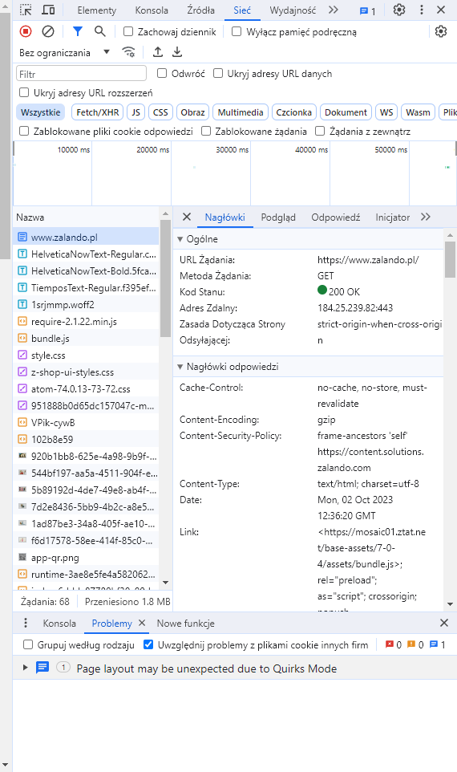
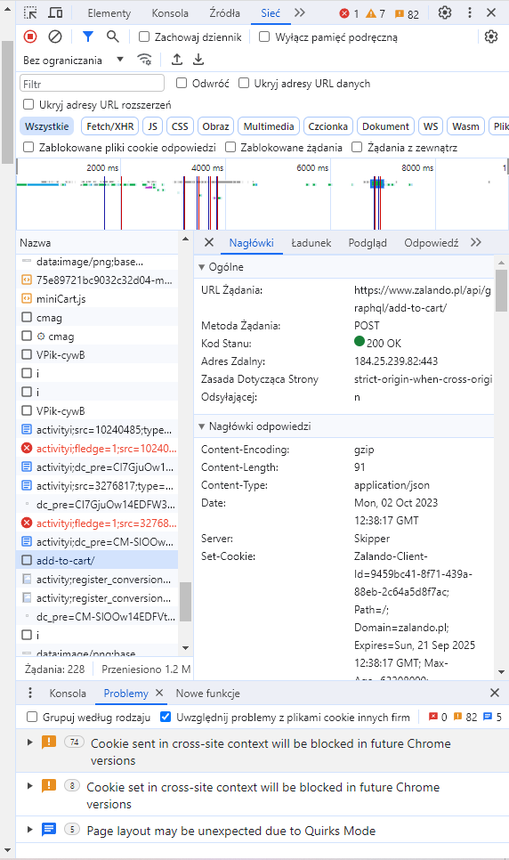

<h1>TASK: Screenshot of queries and statuses add to task, describe result for each query (method, what it means, response code status). PL:Screenshot z zapytaniami i statusami dodaj do zadania,  opisz wynik dla każdego zapytania (metoda, co oznacza, status kodu odpowiedzi)</h1>
<h3>1.</h3>

Otwórz przeglądarkę і devtools (koniecznie przed otwarciem strony!).

Open a browser and devtools (necessarily before opening the page!)

W devtools przejdź do zakładki Network

In devtools, go to the Network tab

Otwórz stronę: https://www.???.pl, przeanalizuj żądanie (tj.jego metodę i status)

Open the site: https://www.???.pl, analyze the request (i.e., its method and status)

Odpowiedź:Metoda "GET" - Przeglądarka wysyła żądanie typu GET żeby otworzyć stronę internetową.
Status 200 OK - oznacza, że żądanie zostało zakończone pomyślnie. 

Answer: method "GET" - The browser sends a GET request to open a web page.
Status 200 OK - indicates that the request was completed successfully. 

<h3>2</h3>

Dodaj dowolny produkt do koszyka i przeanalizuj żądanie add-to-cart (tj.jego metodę i status)

Add any product to cart and analyze the add-to-cart request

Odpowiedź: metoda "POST" - słuzy do wysłania informacji z formularza znajdującego się na stronie internetowej.
Status 200 OK - oznacza, że żądanie zostało zakończone pomyślnie.

Answer: method "POST" - is used to send information from the form on the website.

<h3>3</h3>

Otwórz stronę:
https://www.???.pl/test i przeanalizuj żądanie (tj.jego metodę i status)

Open the site: https://www.???.pl, analyze the request (i.e., its method and status)

Odpowiedź:Metoda "GET" - Przeglądarka wysyła żądanie typu GET żeby otworzyć stronę internetową.
Status 404 Not Found (Błąd po stronie klienta) - żądanie nie mogło dopasować adresu URL klienta do zasobu. 

Answer: method "GET - The browser sends a GET request to open a web page. Status 404 Not Found (Client-side error) - the request could not match the client's URL to the resource."

